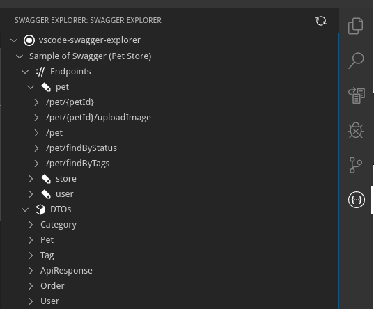
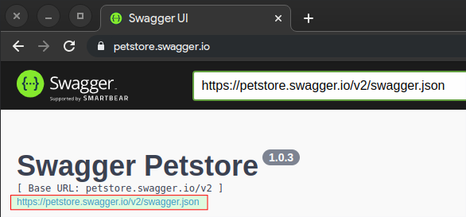
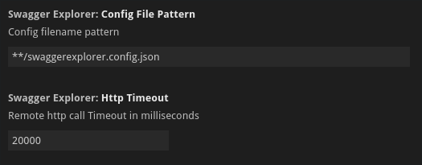

# swagger-explorer README

This is the README for "swagger-explorer" extension.
This project helps you to work with Swagger API documentation in Visual Studio Code.

## Features

This extensions helps you to browse yours per project Swagger or OpenAPI endpoints:



## Requirements

No dependencies required

## Getting Started

To start to use this extension you need to add a config file (normally `swaggerexplorer.config.json`) in your project and add this settings:

```json
{
  "sources": [
    {
      "label": "Sample of Swagger (Pet Store)",
      "url": "https://petstore.swagger.io/v2/swagger.json"
    }
  ]
}
```

The "url" is the json url visible in the SwaggerUI:



## Extension Settings

This extension contributes the following settings:



- `swaggerExplorer.configFilePattern`: pattern to find the config file in the project
- `swaggerExplorer.httpTimeout`: milliseconds to timeout http(s) calls
- `swaggerExplorer.validateSource`: a boolean that tells parser to validate the source during parsing

This extension works with OpenAPI v3 documents and uses the `swagger2openapi` npm library to convert swagger v2 json into OpenAPI v3 document.

## Known Issues

Actually you can only browse the endpoints tree and the DTOs (schemas).

## Release Notes

### 0.0.1

- Swagger Explorer Tree

## Changelog

[Show the changelog](./CHANGELOG.md)
