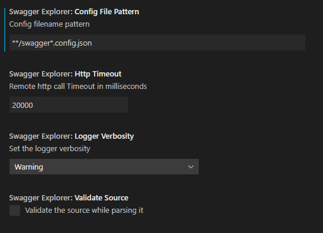

[](https://marketplace.visualstudio.com/items?itemName=ganori80.swagger-explorer&ssr=false#review-details)

# swagger-explorer README

This project helps you to work with Swagger API documentation in Visual Studio Code.

# Contribution
Do you like this project? Support it by donating, creating an issue or pull request.

[](https://www.paypal.com/cgi-bin/webscr?cmd=_donations&business=PXMKQEFQFA28A&item_name=Support+developer+of+swagger+explorer+extension+for+visual+studio+code&currency_code=EUR&source=url)

## Features

This extensions helps you to browse yours per project Swagger or OpenAPI endpoints:


## Requirements

No dependencies required

## Getting Started

To start to use this extension you need to add a config file (normally `swaggerexplorer.config.json`) in your project and add this settings:

```json
{
  "sources": [
    {
      "label": "Sample of Swagger (Pet Store)",
      "url": "https://petstore.swagger.io/v2/swagger.json"
    }
  ]
}
```

The "url" is the json url visible in the SwaggerUI:


## Extension Settings

This extension contributes the following settings:



- `swaggerExplorer.configFilePattern`: pattern to find the config file in the project, now supports multiple files: `**/swaggerexplorer.config.json;**/swexp.config.json`
- `swaggerExplorer.httpTimeout`: milliseconds to timeout http(s) calls
- `swaggerExplorer.validateSource`: a boolean that tells parser to validate the source during parsing

This extension works with OpenAPI v3 documents and uses the `swagger2openapi` npm library to convert swagger v2 json into OpenAPI v3 document.

## Known Issues

Actually you can only browse the endpoints tree and the DTOs (schemas).

## Third party libraries

dependencies defined in package.json:

| library          | npm                                              |
|------------------|--------------------------------------------------|
| lodash           | [https://www.npmjs.com/package/lodash]           |
| swagger-parser   | [https://www.npmjs.com/package/swagger-parser]   |
| swagger2openapi  | [https://www.npmjs.com/package/swagger2openapi]  |

## Release Notes

### 0.0.7

- Swagger files are now cached

### 0.0.5

- Added support for multiple file patterns in Settings

### 0.0.4

- Swagger Explorer Tree

## Changelog

[Show the changelog](./CHANGELOG.md)
